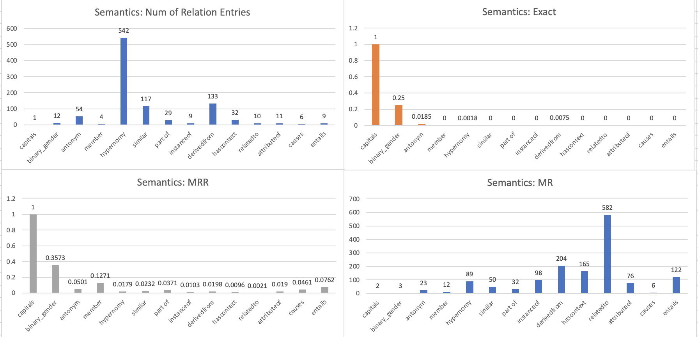
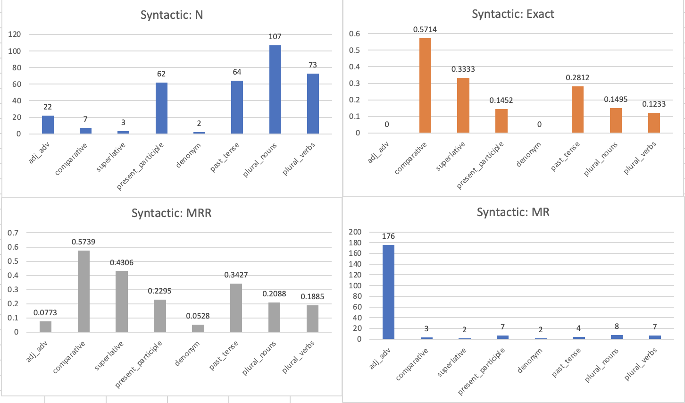

# Report
CBOW model is implemented and is experimented with 2 different context window lengths.

Table of Content
- [Implementation Choices](#implementation-choices)
  - [Encoding](#encoding)
  - [Hyperparameters](#hyperparameters)
  - [Model](#cbow-model)
  - [Optimizer](#optimizer)
  - [Loss Criterion](#loss-criterion)
- [Released Code Analysis](#released-code-analysis)
  - [Tasks](#tasks)
  - [Metrics](#metrics)
  - [Assumptions/Simplifications](#assumptionssimplifications-what-might-go-wrong-overunder-estimate-model-performance)
- [Performance](#Performance)
  - [CBOW-4-word-context: in vitro](#cbow-4-word-context-in-vitro)
  - [CBOW-4-word-context: in vivo](#cbow-4-word-context-in-vivo)
  - [CBOW-8-word-context: in vitro](#8-words-as-context-in-vitro)
  - [CBOW-8-word-context: in vivo](#8-word-context-in-vivo)
- [Other Comments](#other-possible-concernsimprovements)

## Implementation Choices
- n_epochs = 10
- Validate every 1 epoch
- 70% training, 30% validation
- Batch size = 32

### Encoding
- Word-level tokenizer with 3000 words in dictionary (including 4 other special tokens \<pad\>, \<start\>, \<end\>, and \<unk\>)
- Input: context window lengths of 2 and 4 are used
- Output: target token

### Hyperparameters
| Parameter | Value | Description |
|:---------:|:-----:|:-----------:|
| n_vocab | 3000 | number of vocabulary in the dictionary
| n_embedding | 100 | dimension of embedding layer (chosen arbitrarily)
| context_window_len | 2/4 | total number of tokens used as the context of the target token = 2 * context_window_len

### CBOW Model
- Embedding layer with dimension of 100
- 1 fully connected layer for predicting token (out_feature=n_vocab)
- Forward: embedding vectors of 4/8 context words are first summed up and then passed into the fully connected layer to predict the final token

### Optimizer
Used Adam instead of SGD for better convergence to global minimum with momentum

### Loss Criterion
Used cross entropy loss for multi-class classification

## Released Code Analysis
### Tasks
- In vitro: tested on validation dataset. For instance, for CBOW, the model is still tested on its ability of predicting the target word based on input context. 
- In vivo: Several tasks are involved for in vivo evaluation. All tasks are broken down into 2 categories: semantic and syntactic. 
  - Relations of semantic tasks: capitals, binary gender, antonym, member, hypernomy, similar… 
  - Relations of syntatic tasks: adj and adv, comparative, superlative, plural nouns...

### Metrics
#### In vitro
For accuracy, we select the token with the highest probability and then check if it matches with the actual token. For loss, cross entropy loss is used here. 
#### In vivo 
- For one relation of a task, 1 or more entries are included. For each entry, there are 2 pairs of words that follow the declared relation. 
- Let the 4 words be A, B, C, and D. A and B follows the stated relation, so as C and D. 
- The model is evaluated on whether the learned word embedding space satisfies the equality A-B = C-D
- The evaluation util function first uses <code>gensim.models.KeyedVectors</code> to store and calculate C + B - A. Then, top 1000 words are sampled from the space based on the result.
- 3 values are calculated:
  - Exact: top-1 choice matches with the actual word
  - MRR: the score is calculated based on the word's ranking (1/word's ranking) among all top-1000 sampled words.
  - MR: inverse of MRR

### Assumptions/Simplifications (what might go "wrong", over/under-estimate model performance)
#### In vitro
- 
#### In vivo
- The first potential issue that I noticed is that the number of entries for each relation is not well-balanced. For instance, for semantic tasks, the "hypernomy" relation has 542 entries, whereas "capitals" has only 1 entry. Insufficient number of entries for certain relation/task may cause the metric to both overestimate/underestimate model's performance (the model made a correct/wrong prediction but the result is not representative)).
- Given that evaluation is done based on the result of C + B - A and actual word D, the metric assumes that the word embedding contains vector for the word D (i.e. D exists in our training corpus). However, if we train our model on a smaller dataset / has a smaller vocab size (smaller than 3000 in this case), then we cannot make a correct prediction.
- The metric doesn't take special tokens into consideration. Given that the evaluation metric doesn't ignore special tokens like <pad> while our model has learned how special tokens are related with other words, the metric may underestimate our model's ability of predicting other tokens, because it doesn't exclude special tokens when sampling top-1000 words while there's no special tokens in the downstream evaluation data entries.

## Performance
### CBOW-4-word-context: in vitro
.png)
.png)
.png)
.png)

|                   |   Loss   | Accuracy |
|:-----------------:|:--------:|:--------:|
|     Training      |  4.4439  |  0.2260  | 
|    Validation     |  4.3256  |  0.2230  |

Comments: as can be seen from the table and graphs above, the performance is not very satisfying, for which I suspect that the model may not be complex enough to learn all the relations among input context words.

### CBOW-4-word-context: in vivo
|                   |   Exact   | MRR | MR |
|:-----------------:|:--------:|:--------:|:--------:|
|     Overall      |  0.0489  |  0.0808  |  12  | 
|    Semantics     |  0.0072  |  0.0273  |  37  |
|    Syntax     |  0.1676  |  0.2335  |  4  |

##### Semantics

##### Syntax

Comments: as can be seen from above, the model performs better at capturing syntactic information than semantics, which is reasonable since only 4 words surrounding a target word are used as the word's context, so it's difficult for the model to learn global semantic relations.

##### 8 words as context: in vitro
.png)
.png)
.png)
.png)

|                   |   Loss   | Accuracy |
|:-----------------:|:--------:|:--------:|
|     Training      |  4.3276  |  0.2256  | 
|    Validation     |  4.4369  |  0.2247  |

##### 8-word-context: in vivo
|                   |   Exact  |    MRR   |    MR    |
|:-----------------:|:--------:|:--------:|:--------:|
|      Overall      |  0.0382  |  0.0696  |    14    | 
|     Semantics     |  0.0072  |  0.0250  |    40    |
|       Syntax      |  0.1265  |  0.1965  |     5    |

Comments: 
Overall, the model performs worse for downstream tasks compared to the 4-word-context model (regarding both _in vitro_ and _in vivo_), while the result of the "Exact" metric stays the same. 
I suspect that the model may not have enough data to learn. Given that 8 words are needed to form a valid context window, total number of input entries will be less than that of 4-word-context. Maybe train the model with more epochs/get more data/ have a more complex model architecture will help.

## Other possible concerns/improvements
- Try different dimensions for the embedding layer
- Try other model architecture, such as adding layers to learn a more complex relation
- Try more varying context window length