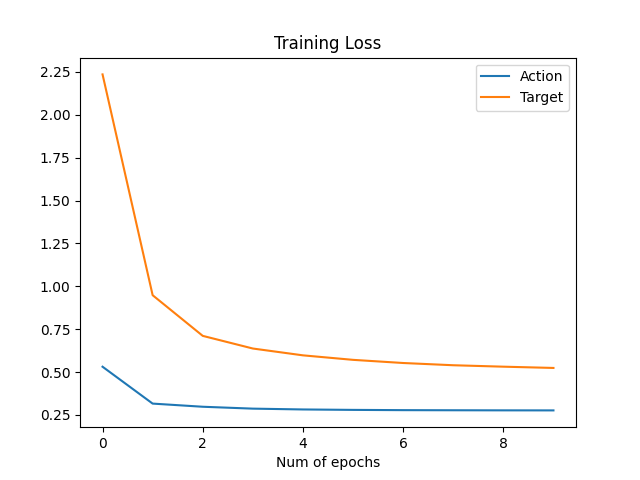
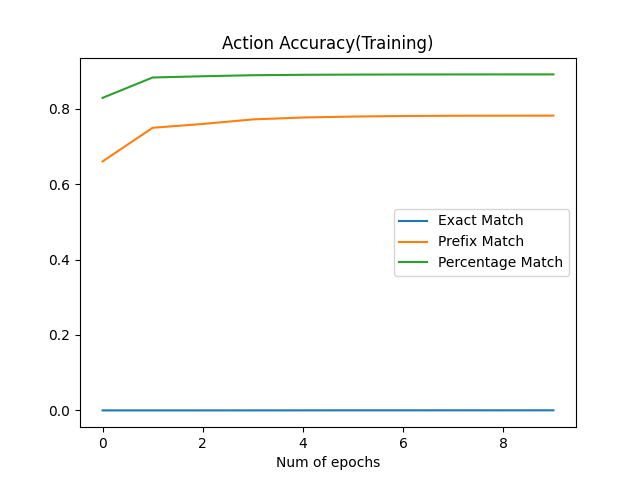
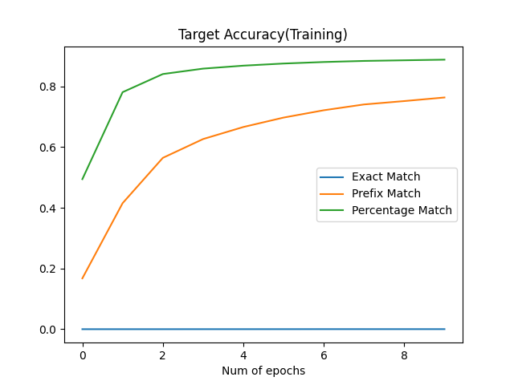
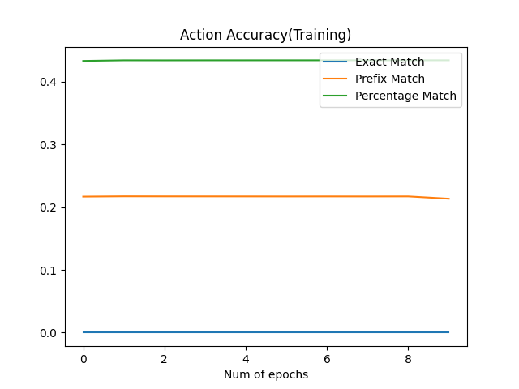
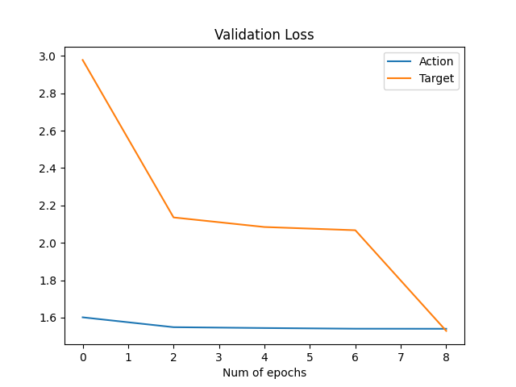

# Report

Table of Content
- [Implementation Choices](#implementation-choices)
  - [Encoding](#encoding)
  - [Implementation of lstm encoder-decoder model](#implementation-of-lstm-encoder-decoder-model)
    - [Encoder](#encoder)
    - [Decoder](#decoder)
    - [Encoder-Decoder Attention](#encoder-decoder-attention)
    - [Optimizer](#optimizer)
    - [Loss](#loss-criterion)
  - [Implementation of Transformer Based Encoder-Decoder Model](#implementation-of-transformer-based-encoder-decoder-model)
- [Performance](#performance)
  - [LSTM Encoder-Decoder Model](#lstm-encoder-decoder-model)
  - [LSTM Encoder-Decoder with Attention](#lstm-encoder-decoder-with-attention)
  - [Transformer Based Encoder-Decoder Model](#transformer-based-encoder-decoder-model)

## Implementation Choices
- n_epochs = 10
- Validate every 2 epochs

### Encoding
- Instructions:
  - All sub-instructions in each episode are concatenated together with white spaces as one entire instruction for each episode
  - Word-level tokenizer with 1000 words in dictionary
  - \<unk\> for unknown words. Other special tokens include \<start\>, \<end\>, \<pad\>
- Target-action pairs:
  - Each target and action are assigned with an index
  - Also add A_START(0), T_START(0), A_END(1), T_END(1), A_PAD(2), T_PAD(2) as special tokens when encoding target-action pairs
- Due to time & CPU limitations, all episode-level instructions are truncated to a length of 100. As a result, approximately 20 pairs of target and action will be predicted for each episode

### Implementation of LSTM Encoder-Decoder Model
#### Encoder
##### Hyperparameters
| Parameter | Value | Description |
|:---------:|:-----:|:-----------:|
| n_vocab | 1000 | Different number of vocabulary in the final dictionary
| embedding_dim | 128 | dimension of embedding layer. Chosen arbitrarily
| hidden_dim | 256 | dimension of hidden LSTM layer. Chosen arbitrarily
| dropout_rate | 0.3 | dropout rate of LSTM layer
| num_layers | 1 | number of LSTM layers stacked together
##### Architecture
- (embedding_layer): Embedding(1000, 128) -> get embeddings of instructions
- (LSTM): LSTM(128, 64, num_layers=2, batch_first=True, dropout=0.3) -> encode instruction embeddings. **pack_padded_sequence** is used to ignore embeddings of pad tokens

#### Decoder
##### Hyperparameters
| Parameter | Value | Description |
|:---------:|:-----:|:-----------:|
| n_actions | 12 | num of distinct actions in provided dataset + start, pad, unk(not used when all entries are used from the dataset), end
| n_targets | 84 | num of distinct targets in provided dataset + start, pad, unk(not used when all entries are used from the dataset), end
| hidden_dim | 64 | hidden dimension of LSTM
| num_layers | 2 | number of LSTM layers
| dropout_rate | 0.3 | dropout rate of LSTM layer
##### Architecture
- (action_embedding_layer): Embedding(12, 128) -> get embedding of actions
- (target_embedding_layer): Embedding(84, 128) -> get embedding of targets
- (LSTM): LSTM(256, 64, num_layers=2, dropout=0.3) -> encode embeddings of actions and targets
- (action_fc): Linear(in_features=64, out_features=12, bias=True) -> predict actions
- (target_fc): Linear(in_features=64, out_features=84, bias=True) -> predict targets
- (attention): Attention(
     (attention_score): Linear(in_features=128, out_features=1, bias=True)
   ) -> see more details in [Encoder-Decoder Attention](#encoder-decoder-attention)

#### Encoder-Decoder Attention
For each time-step, the decoder hidden state is repeated and concatenated with all hidden states from the encoder.
A linear layer with in_feature=2 * hidden_dim = 128 and out_feature=1 is used to calculate the weight/energy of each hidden representation.
Then, all hidden states are multiplied with the weights and summed up to one final hidden representation that will be then used to make target/action predictions. 

#### Optimizer
Used Adam instead of SGD for better convergence to global minimum with momentum

#### Loss Criterion
Used cross entropy loss for multi-class classification

### Implementation of Transformer Based Encoder-Decoder Model
TODO
#### Encoder
#### Decoder
#### Optimizer
#### Loss

## Performance
### Evaluation Metrics
Loss and accuracy of action and target predictions are calculated separately. 3 metrics are used here:
- Exact Match: given a predicted and a ground truth sequence of target, 2 sequences are matched if and only they are exactly the same.
- Prefix match: sequences are iterated from the start to the end linearly and stop when the target/action at the current position of each sequence is different.
- Percentage match: Iterate through all targets/actions (instead of stop early for prefix match), and accuracy = #(matched target/action) / sequence length

### LSTM Encoder-Decoder Model

|                   |   Loss   | Exact Match Acc | Prefix Match Acc | Percentage Match |
|:-----------------:|:--------:|:---------------:|:----------------:|:----------------:|
|  Training Action  |  1.6194  |       0.0       |      0.2028      |      0.2494      |
|  Training Target  |  3.9120  |       0.0       |      0.1014      |      0.1014      |
| Validation Action |  1.6242  |       0.0       |      0.2039      |      0.2806      |
| Validation Target |  3.8865  |       0.0       |      0.1019      |      0.1019      |
As can be seen from above, the accuracy is quite low, for which I suspect that although instructions are truncated, they may still be a little long for the LSTM to learn and produce good hidden representations.
Also, pretrained embedding weights are not used, so maybe using pretrained ones to initialize the embedding layers can be helpful as well. 

### LSTM Encoder-Decoder with Attention

|                   |   Loss   | Exact Match Acc | Prefix Match Acc | Percentage Match |
|:-----------------:|:--------:|:---------------:|:----------------:|:----------------:|
|  Training Action  |  1.6194  |       0.0       |      0.2029      |      0.2494      |
|  Training Target  |  3.9112  |       0.0       |      0.1015      |      0.1015      |
| Validation Action |  1.6237  |       0.0       |      0.2039      |      0.2806      |
| Validation Target |  3.8825  |       0.0       |      0.1020      |      0.1020      |
As can be seen from above, applying the encoder-decoder attention does help the model to decrease the loss to some extent and improve the accuracy to some extent, but the improvement is very insignificant. 
Again, I guess that the instruction may still be a little bit long for the LSTM layer, especially the one in the encoder, to learn and create good representations for the decoder to attend to. 
Also, when I was implementing the encoder-decoder attention, I only takes the hidden representations of the last LSTM layer into account while I have 2 LSTM layers stacked together. Maybe attending representations of both layers can also be helpful.  

### Transformer Based Encoder-Decoder Model
TODO