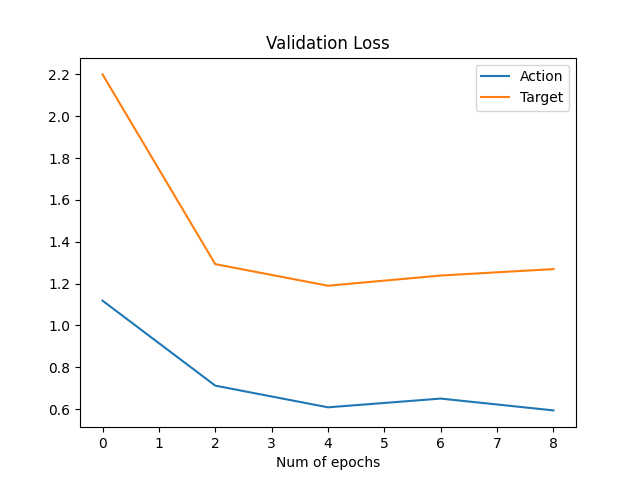
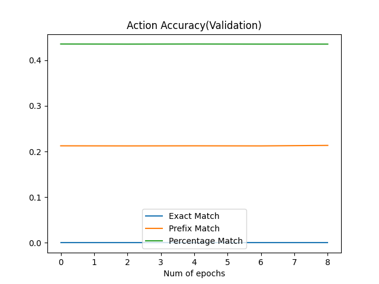
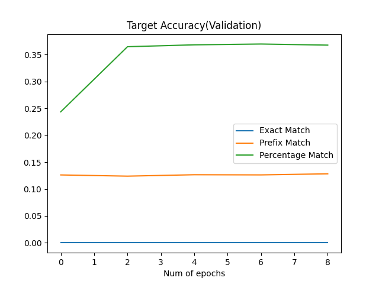

# Report

Table of Content
- [Implementation Choices](#implementation-choices)
  - [Encoding](#encoding)
  - [Implementation of lstm encoder-decoder model](#implementation-of-lstm-encoder-decoder-model)
    - [Encoder](#encoder-lstm)
    - [Decoder](#decoder-lstm)
    - [Encoder-Decoder Attention](#encoder-decoder-attention)
    - [Optimizer](#optimizer)
    - [Loss](#loss-criterion)
  - [Implementation of Transformer Based Encoder-Decoder Model](#implementation-of-transformer-based-encoder-decoder-model)
    - [Encoder](#encoder-transformer-based)
    - [Decoder](#decoder-transformer-based)
- [Performance](#performance)
  - [LSTM Encoder-Decoder Model](#lstm-encoder-decoder-model)
  - [LSTM Encoder-Decoder with Attention](#lstm-encoder-decoder-with-attention)
  - [Transformer Based Encoder-Decoder Model](#transformer-based-encoder-decoder-model)

## Implementation Choices
- batch_size = 256
- n_epochs = 10
- Validate every 2 epochs

### Encoding
- Instructions:
  - All sub-instructions in each episode are concatenated together with white spaces as one entire instruction for each episode
  - Word-level tokenizer with 1000 words in dictionary
  - \<unk\> for unknown words. Other special tokens include \<start\>, \<end\>, \<pad\>
- Target-action pairs:
  - Each target and action are assigned with an index
  - Also add A_START(0), T_START(0), A_END(1), T_END(1), A_PAD(2), T_PAD(2) as special tokens when encoding target-action pairs

### Implementation of LSTM Encoder-Decoder Model
#### Encoder (LSTM)
##### Hyperparameters

| Parameter | Value | Description |
|:---------:|:-----:|:-----------:|
| n_vocab | 1000 | Different number of vocabulary in the final dictionary
| embedding_dim | 128 | dimension of embedding layer. Chosen arbitrarily
| hidden_dim | 128 | dimension of hidden LSTM layer. Chosen arbitrarily
| dropout_rate | 0.3 | dropout rate of LSTM layer
| num_layers | 2 | number of LSTM layers stacked together

##### Architecture
- (embedding_layer): Embedding(1000, 128) -> get embeddings of instructions
- (LSTM): LSTM(128, 64, num_layers=2, batch_first=True, dropout=0.3) -> encode instruction embeddings. **pack_padded_sequence** is used to ignore embeddings of pad tokens

#### Decoder (LSTM)
##### Hyperparameters
| Parameter | Value | Description |
|:---------:|:-----:|:-----------:|
| embedding_dim | 128 | dimension of embedding layers 
| n_actions | 11 | num of distinct actions in provided dataset + start, pad, end
| n_targets | 83 | num of distinct targets in provided dataset + start, pad, end
| hidden_dim | 256 | hidden dimension of LSTM
| num_layers | 2 | number of LSTM layers
| dropout_rate | 0.3 | dropout rate of LSTM layer

##### Architecture
- (action_embedding_layer): Embedding(11, 128) -> get embedding of actions
- (target_embedding_layer): Embedding(83, 128) -> get embedding of targets
- (LSTM): LSTM(256, 256, num_layers=2, dropout=0.3) -> embeddings of actions and targets are concatenated together and passed into LSTM
- (action_fc): Linear(in_features=256, out_features=11, bias=True) -> output logits of action predictions
- (target_fc): Linear(in_features=256, out_features=83, bias=True) -> output logits of target predictions
- (attention): Attention(
     (attention_score): Linear(in_features=512, out_features=1, bias=True)
   ) -> see more details in [Encoder-Decoder Attention](#encoder-decoder-attention)

#### Encoder-Decoder Attention
- Since I concatenated all sub-instructions in one episode together as one entire instruction, so here my attention is flat.
- My attention mechanism is also a global, soft one: 
  - For each time-step, the decoder hidden state is repeated and concatenated with all hidden states from the encoder. 
  - A linear layer with in_feature=2 * hidden_dim = 512 and out_feature=1 is used to calculate the weight/energy of each hidden representation. 
  - Then, all hidden states are multiplied with the weights and summed up to one final hidden representation that will be then used to make target/action predictions.
  - P.S.: given that I have 2 LSTM layers stacked together inside the encoder, I only let the decoder to attend to the hidden states of the last layer. 

#### Optimizer
Used Adam with learning rate of 0.001 instead of SGD for better convergence to global minimum with momentum

#### Loss Criterion
Used cross entropy loss for multi-class classification

### Implementation of Transformer Based Encoder-Decoder Model
For this part, I modify my previous LSTM seq2seq model and replace the encoder with a pretrained BertModel (bert-based-uncased).

#### Encoder (Transformer-based)
- A pretrained BertModel(bert-based-uncased) is used as encoder for the instructions, which has 768 as the dimension of embedding layers and the hidden layers.
- 12 bert layers with self attentions are included in the model.
- The pooler output of the bert model is used as the hidden state that will be passed into the decoder
- The hidden states of the last bert layer is used by the decoder for encoder-decoder attention calculations. 

#### Decoder (Transformer-based)
Same architecture as the [decoder](#decoder), except the hidden dimension of the LSTM layer is changed to 768 to be consistent with that of the pretrained Bert model.

## Performance
### Evaluation Metrics
Loss and accuracy of action and target predictions are calculated separately. 3 metrics are used here:
- Exact Match: given a predicted and a ground truth sequence of target, 2 sequences are matched if and only they are exactly the same.
- Prefix match: sequences are iterated from the start to the end linearly and stop when the target/action at the current position of each sequence is different.
- Percentage match: Iterate through all targets/actions (instead of stop early for prefix match), and accuracy = #(matched target/action) / sequence length

### LSTM Encoder-Decoder Model
TODO

|                   |   Loss   | Exact Match Acc | Prefix Match Acc | Percentage Match |
|:-----------------:|:--------:|:---------------:|:----------------:|:----------------:|
|  Training Action  |    |              |            |            |
|  Training Target  |    |              |            |            |
| Validation Action |    |              |            |            |
| Validation Target |    |              |            |            |

As can be seen from above, the accuracy is quite low, 

Potential issues & solutions:
- Pretrained embedding weights are not used, so maybe using pretrained ones to initialize the embedding layers can be helpful as well. 

### LSTM Encoder-Decoder with Attention
TODO

|                   |   Loss   | Exact Match Acc | Prefix Match Acc | Percentage Match |
|:-----------------:|:--------:|:---------------:|:----------------:|:----------------:|
|  Training Action  |    |              |            |            |
|  Training Target  |    |              |            |            |
| Validation Action |    |              |            |            |
| Validation Target |    |              |            |            |

- When I was implementing the encoder-decoder attention, I only takes the hidden representations of the last LSTM layer into account while I have 2 LSTM layers stacked together. Maybe attending representations of both layers can be helpful.
- Also, the attention currently attends to word-level state. Attending to instruction-level states may make more sense because pairs of target and action come with the corresponding instructions. 

### Transformer Based Encoder-Decoder Model
TODO

|                   |   Loss   | Exact Match Acc | Prefix Match Acc | Percentage Match |
|:-----------------:|:--------:|:---------------:|:----------------:|:----------------:|
|  Training Action  |    |              |            |            |
|  Training Target  |    |              |            |            |
| Validation Action |    |              |            |            |
| Validation Target |    |              |            |            |

- The pretrained bert originally has 30522 as its vocab size. However, for this project, I only have n_vocab=1000, which may cause the model to be unable to fully exploit the pretrained Bert model. 